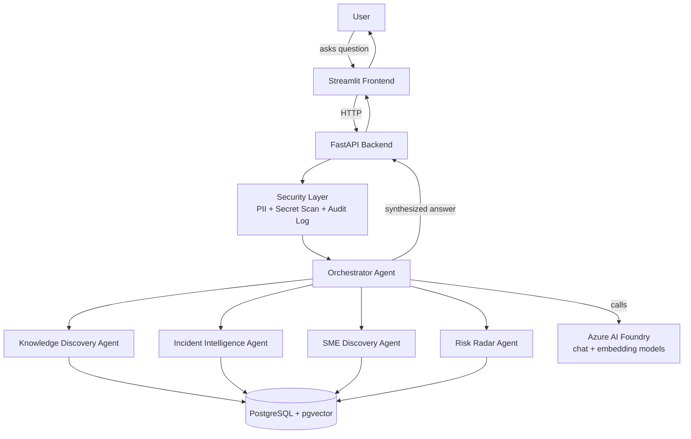
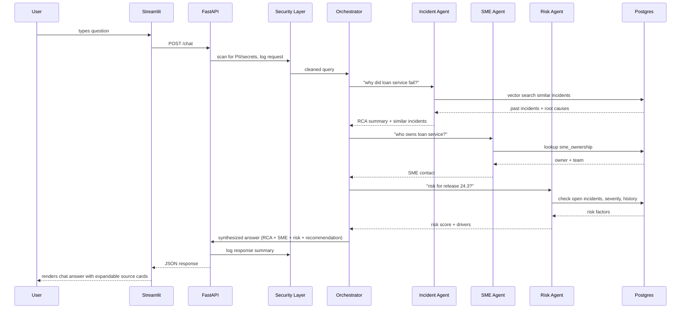
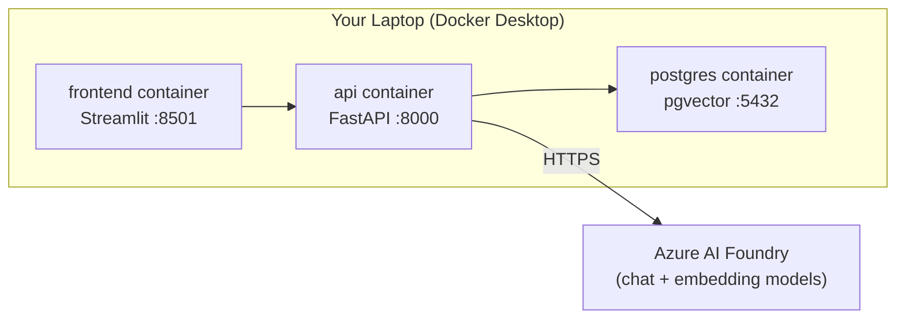

# BuildPulse AI — Architecture Overview (plain-English guide for you)

> This is the companion to the build spec. Read this to understand *why* the system is shaped the way it is, so you can explain it confidently to judges and adapt it on the fly.

---

## 1. The Problem, in One Line

Engineers today have to check five different places — a wiki, an incident tracker, a spreadsheet of who-owns-what, a release calendar, a security tool — to answer one question like *"why did the loan service fail, and can we still release tomorrow?"* BuildPulse collapses those five lookups into one conversation.

---

## 2. High-Level Architecture

Three containers, one brain (the Orchestrator), five specialists, one database that does double duty as both your structured data store and your vector search index.

---

## 3. What Each Piece Actually Does

**Streamlit frontend** — this is just the window. It doesn't think; it sends your question to the backend and renders whatever comes back. Seven pages, but only one (AI Copilot Chat) is where the "magic" happens; the rest are dashboards reading pre-computed data.

**FastAPI backend** — the traffic controller. Every request passes through the security layer first (PII redaction, secret scanning, audit logging), then gets handed to the orchestrator.

**Orchestrator Agent** — the actual "AI" part of the routing. It reads your question, decides which of the 4 domain agents (Knowledge, Incident, SME, Risk) are relevant — sometimes one, sometimes all four — calls them, and stitches their answers into one response. This is what makes "why did loan service fail?" return an RCA *and* a similar incident *and* the right SME *and* a risk flag, instead of you asking four separate questions.

**The 4 domain agents** — each owns one job and one part of the database:
- *Knowledge Discovery* — searches documents by meaning (vector search), not just keyword match.
- *Incident Intelligence* — finds root causes and past incidents that "smell similar" to the current one.
- *SME Discovery* — a structured lookup: system name → owner/team/contact.
- *Risk Radar* — a deterministic scoring formula (not a black-box LLM guess) that says why a release is risky, so you can defend the number to a judge or an auditor.

**Security & Trust Center** — not really a 5th "agent" that answers questions; it's a layer that runs on *every* request, scanning for PII and secrets before anything reaches the LLM, and writing an audit trail of who-asked-what-when. In a bank demo, this is your credibility feature — show the audit log.

**PostgreSQL + pgvector** — one database, two jobs. Normal SQL tables hold incidents/releases/SME data (structured), and the `pgvector` extension lets the same database also store and search text embeddings (semantic/"meaning" search) for documents and past incidents. This avoids running a separate vector database container — fewer moving parts to debug on a laptop during a hackathon.

**Azure AI Foundry** — where the actual language model calls happen: one model for chat/reasoning (used by the orchestrator and agents to summarize/narrate), one model for embeddings (used to convert text into the vectors stored in pgvector).

---

## 4. Walking Through One Example Query

**User asks:** *"Why did the loan service fail, and can release 24.3 still go live tomorrow?"*

Notice the Orchestrator called three agents for one question, and each agent only touched the part of the database it owns. That separation is what lets you demo "add a 6th agent later" credibly — you'd just register a new tool with the orchestrator.

---

## 5. Deployment Picture

Everything except the actual LLM calls runs locally in Docker on your machine — no internal bank network dependency, which matches your constraint of no internal file access. `docker compose up --build` gets the whole demo running from a clean laptop.

---

## 6. Why This Shape (design decisions, so you can defend them)

| Decision | Why |
|---|---|
| Router/orchestrator + specialist agents, not one giant prompt | Keeps each agent's logic small and testable; lets the system answer multi-part questions by combining agents instead of one model trying to do everything at once |
| pgvector inside Postgres, not a separate vector DB | One database container instead of two; one connection string; nothing extra to install on a personal laptop |
| Risk scoring is a deterministic formula + LLM narration, not a pure LLM guess | In a bank, an unexplainable risk number is a liability — a formula with visible drivers ("open P1 incidents", "SME unavailable") is defensible |
| Security layer runs on every request, not just a dedicated "security agent" you have to ask | PII/secret protection has to be automatic, not opt-in, to actually mean something in a bank context |
| Streamlit instead of React/Node frontend | One language (Python) end-to-end, faster to build solo in a hackathon window, no separate frontend build pipeline to manage |
| Sample/synthetic data only, seeded via Faker | You said no internal file access — this also avoids any real-data handling risk during a hackathon demo |

---

## 7. What to Cut First If You Run Out of Time

Priority order to keep, in case the clock runs out:
1. AI Copilot Chat with at least Incident + SME agents working (this is the "wow" demo moment)
2. Executive Dashboard (judges look here second)
3. Audit log visible somewhere (your bank-credibility feature)
4. Risk Radar
5. Knowledge Discovery
6. The remaining individual dashboard pages (Incident Intelligence detail view, SME Directory, Security Center page) — these can be thin/read-only if time is short, since their data is already visible via the chat.

---

## 8. Glossary

- **RAG (Retrieval-Augmented Generation):** looking up relevant documents/data first, then having the LLM answer using that retrieved context instead of just its own memory.
- **Vector/embedding search:** converting text into numbers that capture meaning, so "loan service outage" and "loan platform down" can be matched even without shared keywords.
- **Orchestrator/router agent:** the component that decides which specialist agent(s) should handle a given question.
- **pgvector:** a PostgreSQL extension that adds vector search capability directly inside Postgres.
- **Presidio:** Microsoft's open-source library for detecting and redacting PII in text.
